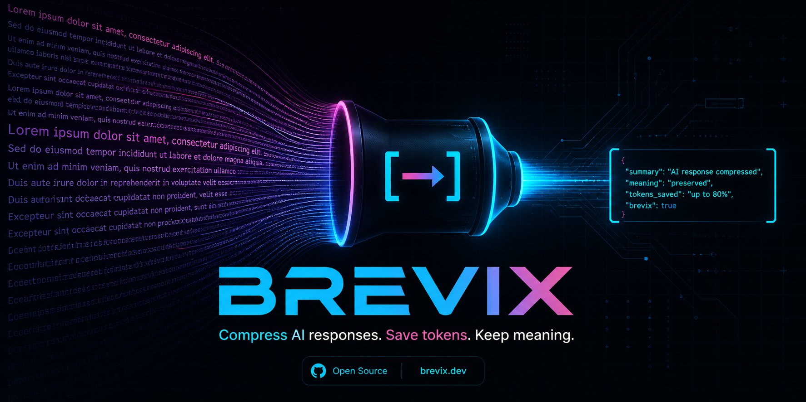

<div align="center">



<br />

# Brevix

### Compress LLM output safely. Save tokens without breaking your code.

<p>
  <a href="https://github.com/Yash-Koladiya30/brevix/actions/workflows/ci.yml"></a>
  <a href="https://github.com/Yash-Koladiya30/brevix/actions/workflows/ci.yml"></a>
  <a href="https://pypi.org/project/brevix/"></a>
  <a href="https://www.npmjs.com/package/brevix-shrink"></a>
  <a href="https://skills.sh/Yash-Koladiya30/brevix"></a>
  <a href="LICENSE"></a>
  <a href="https://www.python.org"></a>
  <a href="https://github.com/Yash-Koladiya30/brevix"></a>
</p>

<p>
  <b>
    <a href="#-install">Install</a> &nbsp;·&nbsp;
    <a href="#-usage">Usage</a> &nbsp;·&nbsp;
    <a href="#-cost-management--model-routing">Cost Routing</a> &nbsp;·&nbsp;
    <a href="#-how-accuracy-guard-works">Accuracy Guard</a> &nbsp;·&nbsp;
    <a href="#-benchmarks">Benchmarks</a> &nbsp;·&nbsp;
    <a href="#-roadmap">Roadmap</a> &nbsp;·&nbsp;
    <a href="docs/CONTRIBUTING.md">Contributing</a>
  </b>
</p>

<p>
  <i>Cuts response tokens <b>40–75%</b> with a deterministic rule engine. Routes each task to the cheapest capable Claude tier — saving up to <b>~80% of API spend</b>. Verifies meaning is preserved before emit. Works across <b>20+ AI coding tools</b>.</i>
</p>

<p>
  
  
  
  
  
</p>

</div>

---

<div align="center">
  
</div>

## Why Brevix

**Brevix is two cost-saving layers in one tool:**

1. **Output compression** — cuts response tokens 40–75% with a rule engine that's verified by a local Accuracy Guard. No silent meaning loss on dense technical prose.
2. **Cost management & smart model routing** — picks the cheapest Claude tier (Haiku / Sonnet / Opus) per task, escalates only on low-confidence answers, and enforces token + USD budget caps. Typical savings: **~80% of API spend** vs always running Opus.

Works with **Claude Code · Cursor · Windsurf · OpenAI Codex CLI · Google Antigravity · Gemini CLI · GitHub Copilot Chat · Aider · Continue.dev · Cline · Roo Code · Zed AI · Augment · Kilo · OpenHands · Tabnine · Warp · Replit · Sourcegraph Amp** — plus any tool reading `AGENTS.md`.

---

<div align="center">
  
</div>

## 💰 Cost Management & Model Routing

> **What it does:** Stops you from paying Opus prices for tasks Haiku can solve in a single shot.

### The problem

Most LLM coding tools call **the most expensive model for every prompt**. A task like *"classify this support ticket"* hits Opus at \$0.05 per call, when Haiku could answer it for \$0.0002 — **250× cheaper**, identical answer.

### The fix

Brevix Route is a thin layer in front of the Anthropic SDK that:

1. **Classifies the task** (regex/keyword-based, ~6μs, no API call).
2. **Picks the cheapest capable model** from a `task → model` rule table you control.
3. **Optionally scores the response** for confidence (hedge phrases, validity, length, optional semantic check).
4. **Escalates** to the next tier (Haiku → Sonnet → Opus) only when confidence is below threshold.
5. **Records every call** to a local JSONL log so you can audit exactly what was saved.

### How to use it

#### Option A — From your code (Python)

```python
from brevix import RoutedClient

client = RoutedClient(log_enabled=True)

# Cheap task -> auto-routed to Haiku.
r = client.call("Classify this ticket: app crashes on login")
print(r.text, r.model, r.cost_usd)
# > "bug"  claude-haiku-4-5  0.000028

# Hard task -> auto-routed to Opus.
r = client.call("Architect a multi-region payment system with sub-100ms p99 latency")
print(r.model)
# > claude-opus-4-7

# Confidence-guarded mode: retries on next tier only if the first answer hedges.
r = client.call("Review this auth middleware for token expiry bugs", confidence_check=True)
print(r.model, r.escalations, r.confidence)
# > claude-opus-4-7  1  0.94
```

#### Option B — From the CLI

```bash
brevix route --init                                    # one-time: write default config
brevix route "classify ticket: app crashes" --explain  # dry-run, show decision + cost
brevix route "..." --call                              # actually call the model
brevix route "..." --call --confidence                 # call + escalate on low conf
brevix route --budget-show                             # current spend
brevix stats --routing --since 7d                      # weekly cost-saved report
brevix route --learn-suggest                           # recommend rule changes
brevix route --learn-apply                             # apply them
```

#### Option C — From Claude Code (slash commands)

After `/plugin install brevix@brevix`:

```
/brevix-route classify this support ticket: "app crashes on login"
        ↓
[brevix] task=classify tier=haiku escalated=0
bug
```

```
/brevix-route architect a multi-region payment system with sub-100ms p99 latency
        ↓
[brevix] task=architecture tier=opus escalated=0
<full Opus response>
```

```
/brevix-route-stats --since 7d         # cost saved vs Opus-only baseline
/brevix-learn                          # suggested rule changes
/brevix-learn apply                    # apply them
```

### Hard budget cap

Edit `~/.brevix/route.json`:

```json
{
  "budget": { "tokens": 0, "cost_usd": 50.00 }
}
```

When the cap is hit, the next call raises `BudgetExceededError` instead of silently overspending.

Or per-run from the CLI:

```bash
brevix route --budget-cost 5.00 --call "your prompt"
```

### Real-world savings

| Workload | Naive (Opus only) | Brevix routed | Saved |
|---|---|---|---|
| Solo dev, 50 calls/day, mostly easy tasks | $0.40/day | $0.06/day | **85%** |
| Team of 5, 500 calls/day, mixed | $4.00/day | $0.80/day | **80%** |
| Customer-support bot, 10k tickets/day, 90% classify | $80/day | $1.50/day | **98%** |

Same answer quality — confidence guard ensures hard cases still hit Opus.

> See the [full Routing tutorial in `## ⚡ Usage`](#-usage) for advanced flags, force-tier overrides, and the auto-tuning learn loop.

---

<div align="center">
  
</div>

## Features

<table>
<tr>
<td width="50%" valign="top">

#### Compression Engine
- **Three modes** — Lite · Full · Ultra
- **Adaptive Auto mode** — picks safest aggressive level per response
- **Protected regions** — code blocks, URLs, error quotes never touched
- **File compression** — `CLAUDE.md`, `AGENTS.md`, project notes with `.original` backup

</td>
<td width="50%" valign="top">

#### Safety & Verification
- **Accuracy Guard** — semantic similarity check before emit
- **Strict mode** — auto-fallback to original when meaning would be lost
- **Local-first** — no telemetry, no API calls in the engine
- **Reproducible benchmarks** — three-arm A/B eval harness with `tiktoken o200k_base`

</td>
</tr>
<tr>
<td width="50%" valign="top">

#### Integrations
- **MCP middleware** (`brevix-shrink`) — compresses tool/prompt/resource descriptions
- **20 platform install targets** — idempotent `BREVIX:BEGIN/END` markers
- **Statusline badge** — `[BREVIX] ⛏ X.Xk saved`
- **Subagents** — investigator · builder · reviewer with terse output

</td>
<td width="50%" valign="top">

#### Insights
- **Real session-log token counts** — `stats --real --since 7d`
- **Shareable savings** — `stats --share` produces tweet-ready output
- **Per-mode breakdown** — see exactly what each level saves
- **Free + MIT licensed**

</td>
</tr>
<tr>
<td colspan="2" valign="top">

#### 💰 Cost Management & Model Routing — *new*
- **Task-aware tiering** — classify/parse → Haiku, code review/debug → Sonnet, architecture → Opus
- **Confidence-driven escalation** — hedge / validity / length scorers retry on the next tier only when needed
- **Hard budget caps** — `BudgetExceededError` blocks runaway spend (per-token or per-USD limits)
- **Routing dashboard** — `brevix stats --routing` shows cost saved vs Opus-only baseline, escalation rate, per-model + per-task breakdown
- **Self-tuning** — `brevix route --learn-suggest|--learn-apply` patches your config from observed escalation patterns
- **Claude Code subagents** — `brevix-haiku` · `brevix-sonnet` · `brevix-opus` plus `/brevix-route` slash dispatcher

</td>
</tr>
</table>

---

<div align="center">
  
</div>

## 🚀 Install

#### One-liner — macOS / Linux / WSL

```bash
curl -fsSL https://raw.githubusercontent.com/Yash-Koladiya30/brevix/main/install.sh | bash -s -- --all
```

#### Windows — PowerShell

```powershell
irm https://raw.githubusercontent.com/Yash-Koladiya30/brevix/main/install.ps1 | iex
```

#### `skills` CLI — one command, 9 tools at once

Auto-installs Brevix skills into Antigravity, Claude Code, Cline, Codex, Cursor, Gemini CLI, GitHub Copilot, Kiro CLI, and Qoder simultaneously.

```bash
npx skills add https://github.com/Yash-Koladiya30/brevix
```

Pick a specific skill:

```bash
npx skills add https://github.com/Yash-Koladiya30/brevix --skill brevix
npx skills add https://github.com/Yash-Koladiya30/brevix --skill brevix-commit
npx skills add https://github.com/Yash-Koladiya30/brevix --skill brevix-stats
```

Listing → [skills.sh/Yash-Koladiya30/brevix](https://skills.sh/Yash-Koladiya30/brevix)

#### Manual install

```bash
pip install brevix                  # core
pip install 'brevix[guard]'         # + semantic Accuracy Guard
pip install 'brevix[tokens]'        # + accurate tiktoken counts
pip install 'brevix[all]'           # everything
```

#### Plug into your LLM coding tool

```bash
brevix install --list                # show all 20 targets
brevix install claude-code           # Claude Code plugin layout
brevix install cursor                # .cursor/rules/brevix.mdc
brevix install codex                 # AGENTS.md + .codex/hooks.json
brevix install gemini                # gemini-extension.json + GEMINI.md
brevix install all                   # write rule files for every tool
```

> Idempotent — re-running updates the Brevix block, leaves your other content alone.

#### Claude Code marketplace

```
/plugin marketplace add Yash-Koladiya30/brevix
/plugin install brevix@brevix
```

#### Browser extension — claude.ai + chatgpt.com

For users who chat in the web UI (no Python, no API key):

1. Clone the repo (or download `extensions/browser/`).
2. Chrome / Edge / Brave → `chrome://extensions` → enable **Developer mode** → **Load unpacked** → pick `extensions/browser/`.
3. Firefox → `about:debugging#/runtime/this-firefox` → **Load Temporary Add-on…** → pick `extensions/browser/manifest.json`.
4. Open https://claude.ai or https://chatgpt.com — the **BREVIX** toolbar appears top-right with a mode dropdown and live token-saved counter.

Full extension docs: [`extensions/browser/README.md`](./extensions/browser/README.md).

#### MCP middleware

Compress upstream MCP server descriptions:

```bash
npm install -g brevix-shrink
```

Wrap any MCP server in your Claude config:

```json
{
  "mcpServers": {
    "fs-shrunk": {
      "command": "npx",
      "args": ["brevix-shrink", "npx", "-y",
               "@modelcontextprotocol/server-filesystem", "/tmp"]
    }
  }
}
```

---

<div align="center">
  
</div>

## ⚡ Usage

#### Slash commands — Claude Code, Cursor, etc.

```
# Output compression
/brevix                  # toggle on (full mode)
/brevix lite             # gentle compression
/brevix ultra            # max compression
/brevix auto             # pick best mode per response
/brevix off              # disable
/brevix-commit           # terse Conventional Commit message
/brevix-check            # run Accuracy Guard on a snippet
/brevix-stats            # show compression savings

# Smart model routing (saves API cost)
/brevix-route <task>     # route to cheapest capable tier (Haiku/Sonnet/Opus)
/brevix-route-stats      # cost saved vs Opus-only baseline
/brevix-learn            # suggested rule changes from observed escalations
/brevix-learn apply      # apply suggestions to ~/.brevix/route.json
```

For Codex CLI (no slash commands), use `$brevix lite|full|ultra|auto|off`.

#### CLI

```bash
# Output compression
brevix compress "Your verbose text here" --mode full
brevix compress -                      # stdin
brevix compress . --mode auto -v       # adaptive picks best
brevix compress . --guard --strict --threshold 0.85

# File compression (CLAUDE.md, AGENTS.md, project notes)
brevix compress-file CLAUDE.md         # writes .original.md backup
brevix compress-file CLAUDE.md --dry-run

# Stats
brevix stats                           # estimated, in-process
brevix stats --real --since 7d         # parsed from Claude Code session logs
brevix stats --share                   # tweet-ready one-liner
brevix stats --reset

# Verification
brevix check "original" "compressed"
brevix count "how many tokens?"

# Install rules into a project
brevix install cursor
brevix install --list

# Smart model routing
brevix route --init                                # write default config to ~/.brevix/route.json
brevix route "classify ticket: app crashes"        # print suggested model
brevix route "..." --explain                       # task, model, est cost, reason
brevix route "..." --call                          # actually call the chosen model
brevix route "..." --call --confidence             # also escalate on low-confidence answers
brevix route --budget-show                         # current spend vs cap
brevix route --budget-tokens 1000000 --budget-cost 50.00 "..." --call
brevix stats --routing                             # cost saved, escalation rate, by model/task
brevix stats --routing --since 7d
brevix route --learn-suggest                       # recommend rule changes
brevix route --learn-apply                         # apply them
```

#### Subagents — Claude Code

`agents/` ships six focused subagents that emit ~60% smaller tool results than vanilla agents:

| Agent | Purpose | Output format |
|-------|---------|---------------|
| **brevix-investigator** | Read-only code locator | `path:line — symbol — note` |
| **brevix-builder** | Surgical 1–2 file edits with verification | Diff + verify status |
| **brevix-reviewer** | Bug-focused diff review | `path:line: 🔴 bug: …. fix.` |
| **brevix-haiku** | Cheap tier — classify, parse, format, rename | Brief, exact answer |
| **brevix-sonnet** | Mid tier — review, refactor, debug, explain | Direct, file:line cited |
| **brevix-opus** | Heavy tier — architecture, multi-agent, hard bugs | Decision + reasoning chain |

#### Smart Model Routing — `/brevix-route`

Save ~80% on Claude API cost without manually picking a model per task.

##### Quick start (5 steps, ~1 minute)

**1. Install Brevix and the Anthropic SDK**

```bash
pip install brevix anthropic
export ANTHROPIC_API_KEY=sk-ant-...
```

**2. Install the Claude Code plugin**

```
/plugin marketplace add Yash-Koladiya30/brevix
/plugin install brevix@brevix
```

This adds the routing-tier subagents (`brevix-haiku` / `brevix-sonnet` / `brevix-opus`) and the `/brevix-route`, `/brevix-route-stats`, `/brevix-learn` slash commands.

**3. Initialize the routing config**

```bash
brevix route --init
```

Writes `~/.brevix/route.json` with sensible defaults: classify→Haiku, code review→Sonnet, architecture→Opus, escalation chain Haiku→Sonnet→Opus, no budget cap.

**4. Use it from Claude Code**

```
/brevix-route classify this support ticket: "app crashes on login"
        ↓
[brevix] task=classify tier=haiku escalated=0
bug
```

```
/brevix-route architect a multi-region payment system with sub-100ms p99 latency
        ↓
[brevix] task=architecture tier=opus escalated=0
<full Opus response>
```

**5. Check what you saved**

```
/brevix-route-stats --since 7d
```

##### How it works under the hood

1. `/brevix-route <task>` runs `brevix route ... --explain` under the hood.
2. Reads the suggested model from CLI output.
3. Spawns the matching subagent (`brevix-haiku` / `brevix-sonnet` / `brevix-opus`) via the `Task` tool.
4. If the subagent returns `escalate: <reason>`, retries on the next tier (capped at 1 retry per tier).
5. Records the call to `~/.brevix/routing_log.jsonl` for stats.

Force a tier when you already know the right one:

```
/brevix-route --force-tier=sonnet refactor this 200-line module
```

#### Track your savings — `/brevix-route-stats`

```
/brevix-route-stats             # all-time
/brevix-route-stats --since 7d  # last week
```

Sample output:

```
Brevix Routing Stats
--------------------
Window:             7d
Calls:              412
Total cost:         $1.84
Opus-only baseline: $9.67
Saved:              $7.83 (80.9%)
Escalations:        18 (4.4% of calls)

By model:
  claude-haiku-4-5    289 (70.1%)  $0.08
  claude-sonnet-4-6   108 (26.2%)  $0.65
  claude-opus-4-7      15 ( 3.7%)  $1.11
```

#### Auto-tune from your usage — `/brevix-learn`

After a few days, Brevix recommends rule changes from observed escalation patterns:

```
/brevix-learn

  refactor: claude-sonnet-4-6 -> claude-opus-4-7
    samples=54  escalation_rate=68.5%
    reason: 37/54 escalated (69%); 32 of those landed on claude-opus-4-7
```

Apply with `/brevix-learn apply` to update `~/.brevix/route.json`. User customizations and budget caps are preserved.

#### Hard budget cap

Edit `~/.brevix/route.json`:

```json
{
  "budget": { "tokens": 0, "cost_usd": 50.00 }
}
```

Or per-run from the CLI:

```bash
brevix route --budget-cost 5.00 --call "your prompt"
```

When the cap is hit, the next call raises `BudgetExceededError` instead of silently overspending.

---

<div align="center">
  
</div>

## 🛡 How Accuracy Guard works

1. Compress output via the rule engine.
2. Score the original vs compressed text with a **local sentence-transformer** (no API cost).
3. If similarity ≥ threshold (default `0.85`) → emit compressed. Otherwise warn, or in `--strict` mode fall back to original.
4. Without `sentence-transformers` installed → falls back to **content-word containment** (drops stopwords without penalty, fair to compression).

> Result: compression you can trust on production code, specs, and contracts.

---

<div align="center">
  
</div>

## 💡 Compression example

**Before**

> The reason your React component is re-rendering on every parent update is that you are passing an inline object as a prop. In JavaScript, every render creates a new object reference, even if the contents are identical. To fix this, wrap the object in `useMemo` so the reference stays stable across renders.

**After** (full mode)

> Inline object prop = new ref each render = re-render. Wrap in `useMemo`.

**Tokens saved:** ~75% &nbsp;·&nbsp; **Meaning preserved:** ✅ similarity `0.91`

---

<div align="center">
  
</div>

## 📊 Benchmarks

Reproducible three-arm A/B harness in [`evals/`](./evals). Compares no-system-prompt vs *"be terse"* control vs Brevix on 10 developer prompts.

| arm       | n  | median | mean  | total | vs baseline | vs control |
|-----------|----|--------|-------|-------|-------------|------------|
| baseline  | 10 | 221    | 247.3 | 2473  | —           | —          |
| control   | 10 | 178    | 191.6 | 1916  | 22.5%       | —          |
| **brevix**| 10 | **119**| **128.4** | **1284** | **48.1%** | **33.0%** |

Run yourself:

```bash
pip install 'brevix[all]' anthropic
export ANTHROPIC_API_KEY=...
python evals/llm_run.py --model claude-sonnet-4-6
python evals/measure.py
```

> The `vs control` column is the honest savings — what Brevix adds *beyond* "just be brief."

---

<div align="center">
  
</div>

## 🗺 Roadmap

- [x] Core compression engine (lite / full / ultra)
- [x] Adaptive (auto) mode
- [x] Accuracy Guard (semantic + content-word fallback)
- [x] Local stats counter
- [x] Multi-platform installer (20 targets)
- [x] File-level compression (`brevix compress-file`)
- [x] MCP middleware (`brevix-shrink`)
- [x] Statusline badge + Claude Code hooks
- [x] Subagents (investigator / builder / reviewer)
- [x] Three-arm eval harness
- [x] PowerShell installer + uninstaller
- [x] Model routing engine (Haiku / Sonnet / Opus tiering)
- [x] Confidence-driven escalation (hedge / validity / length scorers)
- [x] Token + cost budget enforcement (`BudgetExceededError`)
- [x] Routing stats dashboard (`brevix stats --routing`)
- [x] Learn loop (`brevix route --learn-suggest|--learn-apply`)
- [x] Claude Code routing tier subagents + slash commands
- [x] Browser extension MVP (claude.ai + chatgpt.com)
- [ ] VSCode extension UI
- [ ] Browser extension (claude.ai, chatgpt.com web)
- [ ] Two-way compression (compress prompts before send)
- [ ] Custom user-defined rule packs
- [ ] Web dashboard (team tier)

---

<div align="center">
  
  &nbsp;
  
</div>

## 📜 License & Contributing

**MIT** — free for personal and commercial use. Issues and PRs welcome — see [docs/CONTRIBUTING.md](./docs/CONTRIBUTING.md).

<br />

<div align="center">
  <sub>Built with care by <a href="https://github.com/Yash-Koladiya30">Yash Koladiya</a> · If Brevix saves you tokens, ⭐ the repo</sub>
</div>
